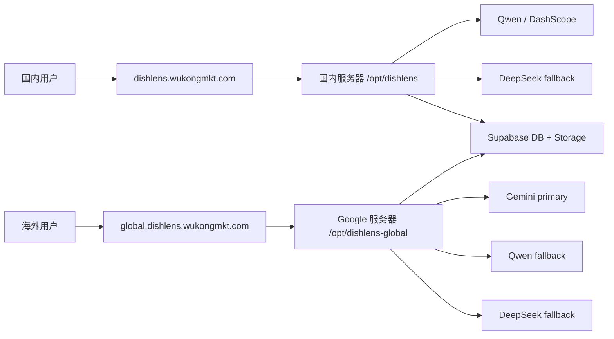

# DishLens 海外 Google 服务器部署交接文档

日期：2026-06-02  
交接对象：Claude Code  
项目目录：`/Users/julian/AI点菜/dishlens`  
线上国内站：`https://dishlens.wukongmkt.com`  
推荐海外站：`https://global.dishlens.wukongmkt.com`

## 1. 背景

当前 DishLens H5 已部署在国内服务器：

- 服务器：`8.133.168.91`
- 线上目录：`/opt/dishlens`
- PM2 应用：`dishlens`
- 域名：`dishlens.wukongmkt.com`

用户反馈：人在海外时，菜单图片识别无法稳定完成。排查结果：

1. `dishlens.wukongmkt.com` DNS 直指国内源站 `8.133.168.91`，海外用户上传菜单照片需要跨境直传到国内服务器。
2. 大图上传链路是主要风险点，尤其移动网络和海外弱网场景。
3. 菜单识别和图片生成是两条链路：
   - 菜单识别：`src/lib/ai/qwen.ts`，主要走 DashScope Qwen-VL。
   - 菜品图片生成：`src/lib/ai/image-gen.ts`，主要走 DashScope Wan。
   - 图片生成慢/错不会阻塞 OCR 识别完成。
4. 国内服务器访问 DashScope 正常，线上实测约 `174ms`。
5. 国内服务器访问 Google Gemini 超时，不适合作为国内服务器兜底。
6. 国内服务器访问 DeepSeek 正常，线上实测约 `170ms`。

目前已上线一个缓解补丁：

- commit：`21d0813 Improve global menu recognition reliability`
- 前端上传压缩从 `1500 / 0.75` 调整到 `1280 / 0.68`
- 上传增加 `45s` 超时
- Loading 轮询超过 `95s` 会进入错误页
- 上传失败不再进入 mock fallback
- AI provider 支持按顺序 fallback
- 国内线上已配置：`MENU_AI_PROVIDER=qwen,deepseek`
- 新增服务端日志：`translate:task_started`、`translate:page_failed`、`translate:task_finished`

这只是缓解。根治方案是新增 Google 服务器海外站，让海外用户上传到海外节点。

## 2. 目标

在用户已有的 Google 服务器上部署一个 DishLens 海外镜像站：

- 国内用户继续访问：`https://dishlens.wukongmkt.com`
- 海外用户访问：`https://global.dishlens.wukongmkt.com`
- 海外图片上传直接进入 Google 服务器，不再跨境上传到国内 ECS。
- 海外服务器优先使用 Gemini 做识别，Qwen/DeepSeek 作为兜底：
  - `MENU_AI_PROVIDER=gemini,qwen,deepseek`
- 两个站共用同一个 GitHub 仓库、Supabase 数据库和任务表。

## 3. 推荐架构



## 4. Claude Code 执行前需要用户提供

请先向用户确认：

1. Google 服务器公网 IP
2. SSH 用户名，例如 `root`、`ubuntu`
3. SSH 私钥或当前机器是否已经可以直接 SSH
4. DNS 管理权限是否可用
5. 是否同意使用子域名：`global.dishlens.wukongmkt.com`
6. 是否允许在 Google 服务器安装：
   - Node.js 22
   - Git
   - Nginx
   - PM2
   - Certbot

如果 SSH 尚未配置，请让用户先确认本机可以执行：

```bash
ssh <user>@<google-server-ip>
```

## 5. DNS 配置

在 `wukongmkt.com` DNS 控制台添加：

```text
类型：A
主机记录：global.dishlens
值：<Google 服务器公网 IP>
TTL：默认或 600
```

等待解析生效：

```bash
dig +short global.dishlens.wukongmkt.com A
```

期望输出为 Google 服务器 IP。

## 6. Google 服务器初始化

以下命令在 Google 服务器执行。

Ubuntu 22.04 / 24.04 推荐：

```bash
sudo apt update
sudo apt install -y git nginx certbot python3-certbot-nginx curl
curl -fsSL https://deb.nodesource.com/setup_22.x | sudo -E bash -
sudo apt install -y nodejs
sudo npm install -g pm2
node -v
npm -v
pm2 -v
```

确认防火墙开放：

```bash
sudo ufw status || true
```

Google Cloud 防火墙规则也需要允许：

- TCP `80`
- TCP `443`
- TCP `22`

## 7. 拉取项目

```bash
sudo mkdir -p /opt/dishlens-global
sudo chown -R $USER:$USER /opt/dishlens-global
cd /opt/dishlens-global
git clone https://github.com/songchunhui513-bit/dishlens.git .
npm install
```

确认当前 commit 至少包含：

```bash
git log --oneline -5
```

应能看到：

```text
21d0813 Improve global menu recognition reliability
```

## 8. 环境变量配置

在 Google 服务器的 `/opt/dishlens-global/.env.production` 写入配置。

可以从国内服务器 `/opt/dishlens/.env.production` 复制大部分内容，但海外站需要调整：

```env
NODE_ENV=production
NEXT_PUBLIC_APP_URL=https://global.dishlens.wukongmkt.com

SUPABASE_URL=<现有 Supabase URL>
SUPABASE_ANON_KEY=<现有 Supabase anon key>
SUPABASE_SERVICE_ROLE_KEY=<如已有则填写，没有可先留空>

NEXT_PUBLIC_SUPABASE_URL=<现有 Supabase URL>
NEXT_PUBLIC_SUPABASE_ANON_KEY=<现有 Supabase anon key>

GEMINI_API_KEY=<现有 Gemini key>
QWEN_API_KEY=<现有 Qwen key>
DEEPSEEK_API_KEY=<现有 DeepSeek key>

MENU_AI_PROVIDER=gemini,qwen,deepseek
IMAGE_PROVIDER=wan
```

注意：

- Google 服务器访问 Gemini 应该稳定，所以海外站优先 `gemini`。
- 如果 Gemini key 不可用，先改成 `MENU_AI_PROVIDER=qwen,deepseek`，保证服务可用。
- `NEXT_PUBLIC_APP_URL` 必须是海外域名，否则分享链接/OG metadata 会指回国内站。

## 9. 构建与 PM2 启动

```bash
cd /opt/dishlens-global
npm run build
pm2 start npm --name dishlens-global -- start
pm2 save
pm2 status
```

默认 Next.js start 会监听 `3000`。如果服务器上已有服务占用 `3000`，改用：

```bash
PORT=3100 pm2 start npm --name dishlens-global -- start
```

若使用 `3100`，Nginx 里的 `proxy_pass` 也要改成 `http://127.0.0.1:3100`。

## 10. Nginx 配置

创建配置：

```bash
sudo nano /etc/nginx/sites-available/dishlens-global
```

写入：

```nginx
server {
    server_name global.dishlens.wukongmkt.com;

    client_max_body_size 30m;

    location / {
        proxy_pass http://127.0.0.1:3000;
        proxy_http_version 1.1;
        proxy_set_header Host $host;
        proxy_set_header X-Real-IP $remote_addr;
        proxy_set_header X-Forwarded-For $proxy_add_x_forwarded_for;
        proxy_set_header X-Forwarded-Proto $scheme;
        proxy_read_timeout 120s;
        proxy_send_timeout 120s;
        proxy_connect_timeout 120s;
    }
}
```

启用：

```bash
sudo ln -s /etc/nginx/sites-available/dishlens-global /etc/nginx/sites-enabled/dishlens-global
sudo nginx -t
sudo systemctl reload nginx
```

## 11. HTTPS 证书

DNS 生效后执行：

```bash
sudo certbot --nginx -d global.dishlens.wukongmkt.com
```

验证自动续期：

```bash
sudo certbot renew --dry-run
```

## 12. 上线验证

基础访问：

```bash
curl -I https://global.dishlens.wukongmkt.com/
```

期望：

```text
HTTP/2 200
```

任务接口：

```bash
curl -s https://global.dishlens.wukongmkt.com/api/v1/task/test-id
```

期望：

```json
{"error":"Task not found"}
```

AI 出网验证，在 Google 服务器执行：

```bash
cd /opt/dishlens-global
set -a && . ./.env.production && set +a
node -e 'const t=Date.now(); fetch("https://generativelanguage.googleapis.com/v1beta/openai/models",{headers:{Authorization:"Bearer "+process.env.GEMINI_API_KEY}}).then(async r=>console.log({status:r.status,ms:Date.now()-t,body:(await r.text()).slice(0,200)})).catch(e=>{console.error(e); process.exit(1)})'
```

期望：

- `status` 为 `200` 或可解释的授权状态。
- 不应该出现 `ConnectTimeoutError`。

真实图片上传测试：

```bash
curl -sS \
  -F target_lang=zh \
  -F images=@/path/to/menu.jpg \
  https://global.dishlens.wukongmkt.com/api/v1/translate/menu
```

返回：

```json
{"task_id":"...","status":"processing"}
```

轮询：

```bash
curl -s https://global.dishlens.wukongmkt.com/api/v1/task/<task_id>
```

期望最终：

```json
{
  "status": "done",
  "result": {
    "pages": [...]
  }
}
```

查看日志：

```bash
pm2 logs dishlens-global --lines 120
```

应能看到：

```text
translate:task_started
translate:task_finished
```

如果 Gemini 失败，会看到：

```text
Provider gemini failed during menu analysis: ...
```

然后应该继续尝试 Qwen / DeepSeek。

## 13. 前端分流策略

第一阶段：手动分流。

- 国内继续使用 `https://dishlens.wukongmkt.com`
- 海外用户使用 `https://global.dishlens.wukongmkt.com`

第二阶段：自动分流。

推荐选项：

1. Cloudflare Worker 根据 `request.cf.country` 判断地区。
2. GeoDNS 根据访问者地区返回国内或海外 IP。
3. 在国内 H5 首页检测 `Intl.DateTimeFormat().resolvedOptions().timeZone`，海外时提示切换到全球站。

短期不建议强制自动跳转，先验证海外站稳定性。

## 14. 回滚方案

如果海外站部署失败：

1. 不影响国内站，国内 `dishlens.wukongmkt.com` 继续运行。
2. 暂停海外 PM2：

```bash
pm2 stop dishlens-global
```

3. 删除或暂停 DNS `global.dishlens` A 记录。

如果新版本代码有问题：

```bash
cd /opt/dishlens-global
git log --oneline -5
git checkout <previous_commit>
npm run build
pm2 restart dishlens-global
```

## 15. 注意事项

1. 不要改国内服务器 `/opt/dishlens`，除非用户明确要求。
2. 不要覆盖国内 `.env.production`。
3. Google 服务器 `.env.production` 里 `NEXT_PUBLIC_APP_URL` 必须使用 `https://global.dishlens.wukongmkt.com`。
4. 如果 Google 服务器上 `3000` 被占用，使用 `PORT=3100` 并同步修改 Nginx。
5. 当前完整测试中可能存在一个本地未提交改动导致的无关失败：
   - 文件：`src/lib/dish-presentation.ts`
   - 该改动与海外服务器部署无关。
   - 不要为了部署海外站擅自回滚用户本地改动。
6. 若要提交部署文档，可单独提交，不要混入业务逻辑。

## 16. Claude Code 建议执行顺序

1. 向用户确认 Google 服务器 IP、SSH 用户和 DNS 权限。
2. SSH 登录 Google 服务器。
3. 安装 Node.js 22、Nginx、PM2、Certbot。
4. 克隆 GitHub 仓库到 `/opt/dishlens-global`。
5. 创建 `.env.production`，设置 `MENU_AI_PROVIDER=gemini,qwen,deepseek`。
6. `npm install && npm run build`。
7. PM2 启动 `dishlens-global`。
8. 配置 Nginx。
9. 配置 DNS。
10. 签发 HTTPS 证书。
11. 真实图片上传测试。
12. 查看 `translate:task_started` / `translate:task_finished` 日志。
13. 给用户交付海外访问 URL 和验证结果。

