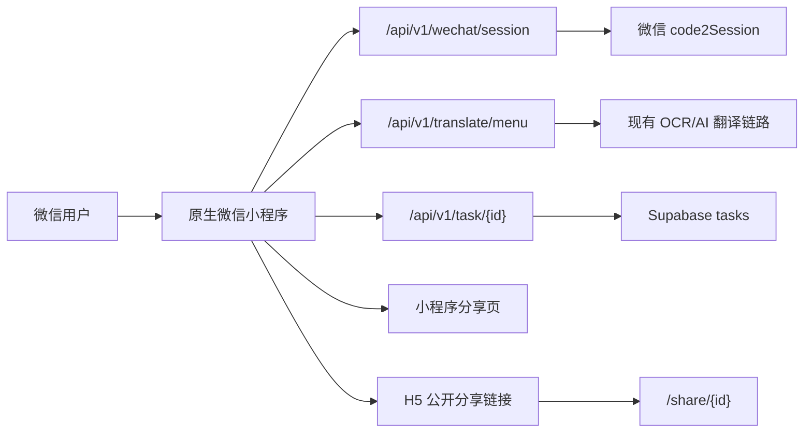
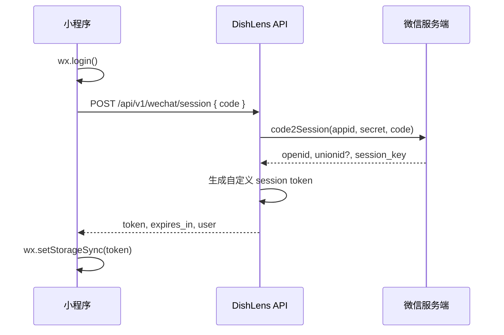
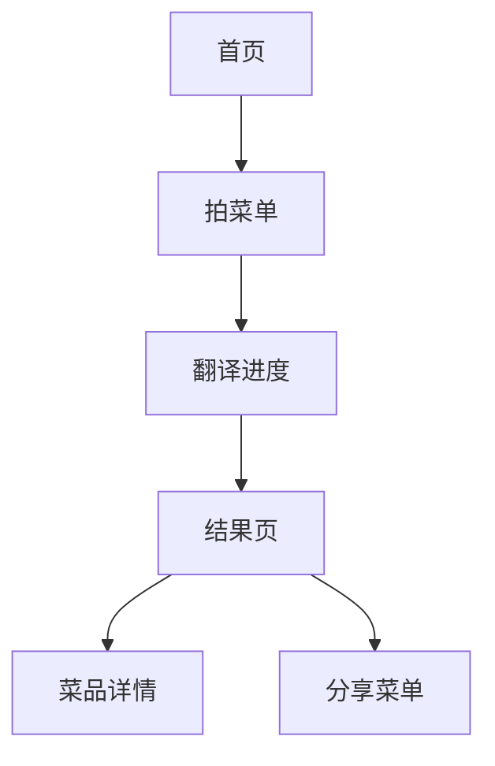

# DishLens 微信小程序技术设计

日期：2026-05-27
分支：feature/wechat-miniprogram

## 1. Architecture

采用原生微信小程序作为新的前端壳层，复用现有 Next.js API、Supabase tasks 缓存和菜单翻译业务模型。



关键原则：

- 小程序目录独立：`apps/wechat-miniprogram`。
- 业务 ID 统一：小程序和 H5 都使用 `task_id`。
- 分享双通道：小程序内分享卡片 + H5 公开 URL。
- 微信 AppSecret 只存在服务端环境变量。

## 2. File Structure

新增文件责任：

- `apps/wechat-miniprogram/project.config.json`：微信开发者工具项目配置。
- `apps/wechat-miniprogram/miniprogram/app.json`：页面注册与全局窗口配置。
- `apps/wechat-miniprogram/miniprogram/app.js`：启动静默登录。
- `apps/wechat-miniprogram/miniprogram/app.wxss`：小程序全局视觉系统。
- `apps/wechat-miniprogram/miniprogram/utils/config.js`：API 域名与分享 URL。
- `apps/wechat-miniprogram/miniprogram/utils/request.js`：微信 request/uploadFile 封装。
- `apps/wechat-miniprogram/miniprogram/utils/auth.js`：静默登录与本地 session。
- `apps/wechat-miniprogram/miniprogram/utils/api.js`：菜单翻译、任务轮询 API。
- `apps/wechat-miniprogram/miniprogram/utils/share.js`：小程序分享路径与 H5 链接生成。
- `apps/wechat-miniprogram/miniprogram/pages/*`：原生页面。
- `src/app/api/v1/wechat/session/route.ts`：小程序静默登录服务端入口。
- `src/lib/wechat/session.ts`：自定义微信 session token 签发/校验。
- `scripts/check-miniprogram.mjs`：本地小程序文件结构检查。

## 3. Login Flow



实现约束：

- `code` 只能使用一次。
- `session_key` 不返回给小程序。
- `api.weixin.qq.com` 由服务端访问，小程序不直接调用。
- 小程序后续请求使用 `Authorization: Bearer {token}`。

环境变量：

```bash
WECHAT_MINIPROGRAM_APPID=
WECHAT_MINIPROGRAM_SECRET=
WECHAT_SESSION_JWT_SECRET=
NEXT_PUBLIC_APP_URL=https://dishlens.wukongmkt.com
```

## 4. Profile Strategy

M1 登录只建立微信身份，不强制头像昵称。

需要资料时：

- 头像：`button open-type="chooseAvatar"`。
- 昵称：`input type="nickname"`。
- 小程序保存草稿到本地，后续接 `/api/v1/wechat/profile` 落库。

这样可以避免用户第一次拍菜单前被授权弹窗打断。

## 5. Menu Translation Flow

M1 页面流：



API 复用：

- 创建任务：`POST /api/v1/translate/menu`
- 查询任务：`GET /api/v1/task/{taskId}`
- 分享公开页：`GET /share/{taskId}`

上传说明：

- 现有 H5 端使用 browser `FormData` 一次传多张图片。
- 微信小程序 `wx.uploadFile` 更适合单文件上传。
- M1 先用单张图片跑通端到端，技术债明确记录；M2 增加 `/api/v1/wechat/translate/menu` 或 presigned upload，以完整支持 20 张多图。

## 6. Share Flow

小程序主路径：

- 分享按钮触发原生 `onShareAppMessage`。
- 分享路径：`/pages/share-menu/index?taskId={taskId}`。
- 接收者打开小程序分享页，调用 `/api/v1/task/{taskId}` 读取结果。

H5 兜底：

- 复制链接：`https://dishlens.wukongmkt.com/share/{taskId}`。
- WhatsApp、Telegram、LINE、Facebook、X 继续使用 H5 分享链接。
- H5 和小程序可以用同一个 `taskId` 指向同一份菜单。

## 7. WeChat Console Configuration

微信小程序后台需要配置：

- request 合法域名：`https://dishlens.wukongmkt.com`
- uploadFile 合法域名：`https://dishlens.wukongmkt.com`
- downloadFile 合法域名：`https://dishlens.wukongmkt.com`，以及实际菜品图片 CDN 域名。
- 业务域名：如后续使用 web-view 承载 H5，则需要配置并校验 `dishlens.wukongmkt.com`。

注意：

- 小程序网络请求域名必须 HTTPS。
- 不能配置 IP、localhost 作为正式请求域名。
- AppSecret 不允许下发到小程序端。

参考微信官方文档：[网络能力](https://developers.weixin.qq.com/miniprogram/dev/framework/ability/network.html)。

## 8. Data Model

小程序复用现有前端类型结构：

- `Dish`
- `MenuPage`
- `TranslationResult`
- `TaskProgress`

小程序端以 JS 对象消费 API 返回值，不新增不兼容字段。

## 9. Testing Strategy

本地检查：

```bash
npm run miniprogram:check
npm run lint
npm run build
```

微信开发者工具检查：

- 使用 `apps/wechat-miniprogram` 作为项目目录。
- 首次可用 `touristappid` 打开预览。
- 正式联调用新建小程序 AppID 替换 `project.config.json` 中的 appid。
- 真机调试验证相机、相册、分享、头像昵称填写。

## 10. Rollout Plan

M1：

- 建分支和小程序独立目录。
- 建立 PRD/技术设计/实施计划。
- 首页、拍菜单、加载、结果、详情、分享、资料页基础骨架。
- 服务端微信静默登录入口。
- 结构检查脚本。

M2：

- 小程序专用多图上传适配。
- 微信 session 与历史/收藏/资料落库。
- 分享封面图与小程序码。
- 真机联调与审核资料准备。

M3：

- 海外 H5 分享落点优化。
- 小程序数据埋点。
- 分享打开率/翻译完成率 dashboard。
