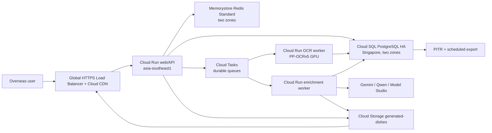

# DishLens Google Cloud Singapore Stability Architecture Implementation Plan

> **For agentic workers:** REQUIRED SUB-SKILL: Use superpowers:subagent-driven-development (recommended) or superpowers:executing-plans to implement this plan task-by-task. Steps use checkbox (`- [ ]`) syntax for tracking.

**Goal:** Move DishLens's production-critical recognition, database, cache, task, and image-storage path into a highly available Google Cloud Singapore stack while keeping external AI providers asynchronous and replaceable.

**Architecture:** Run the web/API and recognition workers in `asia-southeast1`, with Cloud SQL for PostgreSQL as the durable source of truth, Memorystore Redis as an expendable coordination layer, Cloud Tasks as the durable queue, and Cloud Storage plus Cloud CDN as the only public image origin. Keep Supabase and Alibaba OSS behind adapters during migration, dual-write until reconciliation is clean, then remove them from the critical path without changing the product UI.

**Tech Stack:** Next.js 16, TypeScript, Cloud Run, Cloud SQL PostgreSQL HA, Memorystore for Redis Standard Tier, Cloud Tasks, Cloud Storage, Cloud CDN, Google Secret Manager, Cloud Monitoring, Terraform, Node test runner

---

## 1. Decision Record

### Chosen architecture

Use **Google Cloud Singapore as the single production-critical cloud**.

| Concern | Decision | Reason |
| --- | --- | --- |
| Compute | Cloud Run in `asia-southeast1` | Existing production is already on GCP; Singapore is available for Cloud Run and GPU workers. |
| Durable database | Cloud SQL PostgreSQL regional HA | Primary and standby span two zones and synchronously replicate committed writes. |
| Hot task state | Memorystore Redis Standard Tier | Cross-zone replica and automatic failover; loss never loses completed menu results. |
| Durable jobs | Cloud Tasks | Recognition and enrichment jobs survive process restarts and can be retried idempotently. |
| Images | Cloud Storage regional bucket plus Cloud CDN | Stable object keys replace provider-signed URLs and Supabase public URLs. |
| Recognition | PP-OCRv5 worker on Cloud Run GPU, with current Gemini/Qwen fallback | Fast multilingual OCR in-region; provider fallback remains replaceable. |
| Translation | Fast structured model call; minimal result first | The 5-10 second result target excludes recommendation and image enrichment. |
| AI images | Existing Alibaba Model Studio or another provider behind `ImageGenerationProvider` | Image generation is asynchronous and never blocks the menu result page. |
| Authentication | `AuthProvider` boundary; anonymous sharing stays first-party | Supabase Auth must not keep the database dependency alive. |

Google documents that Cloud SQL regional HA synchronously replicates writes across two zones and performs automatic failover with an expected interruption of roughly 60 seconds: <https://cloud.google.com/sql/docs/postgres/high-availability>. Cloud Run is available in Singapore and supports L4 and RTX PRO 6000 GPU workers there: <https://cloud.google.com/run/docs/locations>. Memorystore Standard Tier provides replication and automatic failover: <https://cloud.google.com/memorystore/docs/redis/redis-tiers>. Cloud Storage regional data is redundant across at least two zones: <https://cloud.google.com/storage/docs/availability-durability>.

### Why Alibaba Cloud is not the primary stack

Alibaba Cloud Singapore is technically viable: ApsaraDB RDS PostgreSQL High-availability Edition provides primary/standby instances and automatic failover. It is not selected because the current application, deployment credentials, domain operations, and production runtime are already on GCP. Moving only the database to Alibaba would add a cross-cloud network dependency to every request; moving the entire stack would expand the migration and operational surface without improving the current overseas-first product path.

Alibaba Model Studio may remain an asynchronous image provider. If mainland China becomes a first-class deployment market, create a separate China deployment cell instead of stretching one database across GCP and Alibaba Cloud.

Reference: <https://www.alibabacloud.com/help/en/rds/apsaradb-rds-for-postgresql/rds-high-availability-edition>.

### Current production facts captured on 2026-08-11

- Supabase project `gbkallzbksmaahzvxezq` had entered `INACTIVE` and required manual restoration.
- `public.dishes` contains **317** rows; 316 have `ai_image_url`, 308 URLs are distinct, and 15 rows participate in duplicate-image groups.
- The local knowledge library contains **1,022** entries, with 997 stable image matches after local and promoted-cache matching. The database and repository are therefore not synchronized.
- Current production compute is one `e2-medium` VM in `us-central1-a`, which is a single-instance and single-zone fault domain.
- The application currently uses process memory, local files, Supabase, and optional OSS as overlapping fallbacks. This prevents consistent results across instances and deployments.
- A cache-busted production run of the four-page, 49-dish French menu initially failed on 2026-08-11 after 46.1 seconds with zero dishes. Gemini returned HTTP 429 and the stale production Qwen key returned HTTP 400 `Arrearage`; all four pages failed. After replacing the stale key and making Qwen primary, the same four-page flow returned 49 dishes, reached its first result in 24.65 seconds, completed text in 51.35 seconds, and later reached 49/49 images. Availability was restored, but the 5-10 second first-result SLO remains unmet.

## 2. Target Runtime



### Request contract

1. Upload returns a stable `taskId` after the source image is stored.
2. A fast recognition job writes the minimal menu result: original name, translated name, price, category, source page, confidence.
3. The result page opens as soon as the minimal result is committed. For 30-50 dishes, the service target is p95 under 10 seconds.
4. Descriptions, recommendations, image matching, and AI image generation run as independent enrichment jobs.
5. Every job is idempotent by `contentHash + pipelineVersion + jobType`.
6. Redis may accelerate polling, but PostgreSQL owns task state and the final result. Losing Redis cannot lose a menu.
7. The database stores image object keys and versions, never expiring provider URLs. The CDN URL is constructed at read time.

### Fault boundaries

| Failure | Expected behavior |
| --- | --- |
| One Cloud Run instance fails | Load balancer routes to healthy instances; queued work retries. |
| One Singapore zone fails | Cloud SQL and Redis fail over across zones; Cloud Run replaces instances. |
| Redis unavailable | API reads PostgreSQL task snapshots; recognition continues with reduced polling efficiency. |
| Gemini/Qwen unavailable | Fast OCR result remains available; translation retries or uses the configured fallback. |
| Image provider unavailable | Menu list and details remain usable with local/category placeholders; image job retries later. |
| Supabase paused or removed | No user-visible effect after cutover because it is outside the serving path. |
| Singapore regional outage | Static images remain CDN-cached; restore PostgreSQL from cross-region backup into the designated DR region. |

## 3. Reliability Targets

| Metric | Target | Measurement |
| --- | --- | --- |
| Menu API availability | 99.95% monthly | Load balancer successful request ratio, excluding client 4xx. |
| First usable result, 30-50 dishes | p50 <= 6 s, p95 <= 10 s | Upload accepted to `minimal_result_ready_at`. |
| Repeat upload | p95 <= 2 s | Hash cache hit to result response. |
| Database zonal failover | RPO 0, RTO <= 2 min | Quarterly controlled Cloud SQL failover drill. |
| Regional disaster recovery | RPO <= 15 min, RTO <= 60 min | Quarterly restore drill into the DR region. |
| Generated image durability | No provider URL expiry | Daily broken-image probe over sampled CDN object keys. |
| Cache correctness | 100% final results durable in PostgreSQL | Reconciliation query between Redis terminal tasks and PostgreSQL. |

Alert when p95 first-result latency exceeds 10 seconds for 10 minutes, terminal task error rate exceeds 2% for 10 minutes, Cloud SQL connection use exceeds 70%, queue oldest-age exceeds 60 seconds, or sampled CDN image failures exceed 0.5%.

## 4. Repository Boundaries

### Files to create

- `src/lib/data/database.ts`: repository contracts and shared record types.
- `src/lib/data/postgres.ts`: Cloud SQL implementation using pooled PostgreSQL connections.
- `src/lib/data/supabase-compat.ts`: temporary read/write adapter used only during migration.
- `src/lib/cache/task-cache.ts`: Redis-only hot cache; never the durable source of truth.
- `src/lib/jobs/job-queue.ts`: queue interface and idempotency key rules.
- `src/lib/jobs/cloud-tasks.ts`: Cloud Tasks implementation.
- `src/lib/storage/image-storage.ts`: stable image object contract.
- `src/lib/storage/gcs-storage.ts`: Cloud Storage implementation.
- `src/lib/auth/provider.ts`: provider-neutral authenticated-user contract.
- `db/migrations/0001_core.sql`: production PostgreSQL schema.
- `db/migrations/0002_indexes.sql`: query and idempotency indexes.
- `scripts/migrate-supabase-to-cloudsql.mjs`: resumable data migration.
- `scripts/verify-cloudsql-migration.mjs`: count, checksum, foreign-key, and URL reconciliation.
- `scripts/benchmark-overseas-regions.mjs`: regional 30-50 dish benchmark runner.
- `infra/gcp/main.tf`: APIs, networking, Cloud Run, Cloud SQL, Redis, Tasks, Storage, CDN, IAM.
- `infra/gcp/variables.tf`: explicit environment inputs.
- `infra/gcp/outputs.tf`: service URL, database connection, bucket, and queue names.
- `tests/data-contracts.test.mjs`: provider contract and failure-mode tests.
- `tests/migration-reconciliation.test.mjs`: fixture-based migration verification.

### Files to modify

- `src/lib/cache/task-store.ts`: use durable repository plus Redis cache; remove process-memory terminal ownership.
- `src/lib/db/supabase.ts`: retain only in compatibility mode, then delete after final rollback window.
- `src/lib/storage/supabase-storage.ts`: become a compatibility wrapper over `ImageStorage`.
- `src/lib/storage/oss-storage.ts`: remain an optional provider, not the public serving origin.
- `src/lib/dish-image-persistence.ts`: persist object key, checksum, version, and source.
- `src/lib/dish-image-url.ts`: build CDN URLs from object keys.
- `src/lib/safe-image-url.ts`: trust only the configured CDN origin and checked local assets.
- `src/app/api/v1/translate/menu/route.ts`: write durable task and enqueue recognition before returning.
- `src/app/api/v1/task/[id]/route.ts`: read Redis first, PostgreSQL second.
- `src/app/api/v1/dish/[id]/generate-image/route.ts`: enqueue an idempotent image job instead of waiting inline.
- `src/app/api/v1/history/route.ts`: use `Database` and `AuthProvider` contracts.
- `src/app/api/v1/favorites/route.ts`: use `Database` and `AuthProvider` contracts.
- `src/app/api/v1/dish/[id]/review/route.ts`: use the provider-neutral repository.
- `src/app/api/v1/dish/[id]/reviews/route.ts`: use the provider-neutral repository.
- `src/app/api/v1/user/profile/route.ts`: use the provider-neutral repository.
- `.env.example`: document GCP resource names and migration flags without secrets.
- `tests/logic-regressions.test.mjs`: keep existing UI and recognition behavior protected during migration.

## 5. Migration Guardrails

- No flag may switch reads to Cloud SQL until migration verification reports exact row counts, primary-key parity, and zero invalid stable-image keys.
- Dual-write is permitted only after each write has an idempotency key. A retry must not create duplicate menus, tasks, dishes, favorites, or reviews.
- Supabase remains readable for seven days after 100% traffic cutover, then becomes export-only for another 23 days.
- Rollback changes flags and traffic only. It must not require a reverse data migration during an incident.
- Schema changes use additive columns and tables until the rollback window closes.
- The existing UI baseline remains unchanged throughout the infrastructure migration.

## Task 1: Introduce Provider-Neutral Database Contracts

**Files:**
- Create: `src/lib/data/database.ts`
- Create: `tests/data-contracts.test.mjs`
- Modify: `src/lib/db/supabase.ts`

- [ ] **Step 1: Write the failing database contract test**

```js
test("database contract exposes durable tasks and dish image records", async () => {
  const source = await readFile(`${ROOT}/src/lib/data/database.ts`, "utf8");
  assert.match(source, /export interface Database/);
  assert.match(source, /createMenuTask/);
  assert.match(source, /updateMenuTask/);
  assert.match(source, /getMenuTask/);
  assert.match(source, /upsertDishImage/);
  assert.match(source, /findDishImageByNormalizedName/);
});
```

- [ ] **Step 2: Run the contract test and confirm the missing file failure**

Run: `node --test tests/data-contracts.test.mjs`

Expected: FAIL with `ENOENT` for `src/lib/data/database.ts`.

- [ ] **Step 3: Add the minimal provider-neutral contract**

```ts
export type MenuTaskStatus = "queued" | "recognizing" | "minimal_ready" | "enriching" | "completed" | "failed";

export interface MenuTaskRecord {
  id: string;
  contentHash: string;
  pipelineVersion: string;
  status: MenuTaskStatus;
  progress: number;
  result: unknown | null;
  errorCode: string | null;
  createdAt: string;
  updatedAt: string;
}

export interface DishImageRecord {
  normalizedName: string;
  objectKey: string;
  checksum: string;
  version: number;
  source: "knowledge" | "generated" | "restaurant";
}

export interface Database {
  createMenuTask(task: MenuTaskRecord): Promise<void>;
  updateMenuTask(id: string, patch: Partial<MenuTaskRecord>): Promise<void>;
  getMenuTask(id: string): Promise<MenuTaskRecord | null>;
  upsertDishImage(image: DishImageRecord): Promise<void>;
  findDishImageByNormalizedName(name: string): Promise<DishImageRecord | null>;
}
```

- [ ] **Step 4: Run the contract and regression tests**

Run: `node --test tests/data-contracts.test.mjs tests/logic-regressions.test.mjs`

Expected: PASS.

- [ ] **Step 5: Commit the boundary**

```bash
git add src/lib/data/database.ts src/lib/db/supabase.ts tests/data-contracts.test.mjs
git commit -m "refactor: define durable data provider contract"
```

## Task 2: Create the Cloud SQL Schema and PostgreSQL Adapter

**Files:**
- Create: `db/migrations/0001_core.sql`
- Create: `db/migrations/0002_indexes.sql`
- Create: `src/lib/data/postgres.ts`
- Modify: `package.json`
- Modify: `.env.example`
- Test: `tests/data-contracts.test.mjs`

- [ ] **Step 1: Add a failing assertion for an idempotent task index**

```js
test("Cloud SQL schema enforces task and image idempotency", async () => {
  const schema = await readFile(`${ROOT}/db/migrations/0002_indexes.sql`, "utf8");
  assert.match(schema, /unique\s*\(content_hash, pipeline_version\)/i);
  assert.match(schema, /unique\s*\(normalized_name\)/i);
});
```

- [ ] **Step 2: Run the test and confirm it fails for the missing migration**

Run: `node --test tests/data-contracts.test.mjs`

Expected: FAIL with `ENOENT` for `db/migrations/0002_indexes.sql`.

- [ ] **Step 3: Create the durable core tables**

```sql
create table if not exists menu_tasks (
  id uuid primary key,
  content_hash text not null,
  pipeline_version text not null,
  status text not null check (status in ('queued','recognizing','minimal_ready','enriching','completed','failed')),
  progress integer not null default 0 check (progress between 0 and 100),
  result jsonb,
  error_code text,
  created_at timestamptz not null default now(),
  updated_at timestamptz not null default now()
);

create table if not exists dish_images (
  id uuid primary key,
  normalized_name text not null,
  object_key text not null,
  checksum text not null,
  version integer not null default 1,
  source text not null check (source in ('knowledge','generated','restaurant')),
  created_at timestamptz not null default now(),
  updated_at timestamptz not null default now()
);
```

```sql
create unique index if not exists uq_menu_tasks_content_pipeline
  on menu_tasks (content_hash, pipeline_version);
create unique index if not exists uq_dish_images_normalized_name
  on dish_images (normalized_name);
create unique index if not exists uq_dish_images_object_key
  on dish_images (object_key);
create index if not exists idx_menu_tasks_status_updated
  on menu_tasks (status, updated_at);
```

- [ ] **Step 4: Install the PostgreSQL driver and implement a bounded pool**

Run: `npm install pg && npm install -D @types/pg`

```ts
import { Pool } from "pg";
import type { Database } from "@/lib/data/database";

const pool = new Pool({
  connectionString: process.env.DATABASE_URL,
  max: Number.parseInt(process.env.DATABASE_POOL_MAX || "10", 10),
  connectionTimeoutMillis: 3000,
  idleTimeoutMillis: 30000,
});

export function createPostgresDatabase(): Database {
  return {
    async createMenuTask(task) {
      await pool.query(
        `insert into menu_tasks
         (id, content_hash, pipeline_version, status, progress, result, error_code, created_at, updated_at)
         values ($1,$2,$3,$4,$5,$6,$7,$8,$9)
         on conflict (content_hash, pipeline_version) do nothing`,
        [task.id, task.contentHash, task.pipelineVersion, task.status, task.progress, task.result, task.errorCode, task.createdAt, task.updatedAt],
      );
    },
    async updateMenuTask(id, patch) {
      await pool.query(
        `update menu_tasks set
         status = coalesce($2, status), progress = coalesce($3, progress),
         result = coalesce($4, result), error_code = coalesce($5, error_code), updated_at = now()
         where id = $1`,
        [id, patch.status ?? null, patch.progress ?? null, patch.result ?? null, patch.errorCode ?? null],
      );
    },
    async getMenuTask(id) {
      const { rows } = await pool.query("select * from menu_tasks where id = $1", [id]);
      if (!rows[0]) return null;
      const row = rows[0];
      return { id: row.id, contentHash: row.content_hash, pipelineVersion: row.pipeline_version, status: row.status, progress: row.progress, result: row.result, errorCode: row.error_code, createdAt: row.created_at.toISOString(), updatedAt: row.updated_at.toISOString() };
    },
    async upsertDishImage(image) {
      await pool.query(
        `insert into dish_images (id, normalized_name, object_key, checksum, version, source)
         values (gen_random_uuid(),$1,$2,$3,$4,$5)
         on conflict (normalized_name) do update set object_key=$2, checksum=$3, version=$4, source=$5, updated_at=now()`,
        [image.normalizedName, image.objectKey, image.checksum, image.version, image.source],
      );
    },
    async findDishImageByNormalizedName(name) {
      const { rows } = await pool.query("select * from dish_images where normalized_name = $1", [name]);
      if (!rows[0]) return null;
      const row = rows[0];
      return { normalizedName: row.normalized_name, objectKey: row.object_key, checksum: row.checksum, version: row.version, source: row.source };
    },
  };
}
```

- [ ] **Step 5: Run checks and commit**

Run: `node --test tests/data-contracts.test.mjs && npm run lint && npm run build`

Expected: all commands exit 0.

```bash
git add db/migrations src/lib/data/postgres.ts package.json package-lock.json .env.example tests/data-contracts.test.mjs
git commit -m "feat: add Cloud SQL durable data adapter"
```

## Task 3: Separate Durable Task State from Redis Acceleration

**Files:**
- Create: `src/lib/cache/task-cache.ts`
- Modify: `src/lib/cache/task-store.ts`
- Modify: `src/app/api/v1/task/[id]/route.ts`
- Test: `tests/data-contracts.test.mjs`

- [ ] **Step 1: Write a failing fallback-order test**

```js
test("task reads use Redis first and PostgreSQL as the durable fallback", async () => {
  const source = await readFile(`${ROOT}/src/lib/cache/task-store.ts`, "utf8");
  assert.match(source, /await taskCache\.get\(id\)/);
  assert.match(source, /await database\.getMenuTask\(id\)/);
  assert.ok(source.indexOf("taskCache.get(id)") < source.indexOf("database.getMenuTask(id)"));
});
```

- [ ] **Step 2: Run the test and confirm the old store fails the assertion**

Run: `node --test tests/data-contracts.test.mjs`

Expected: FAIL because the store still reads Supabase/process memory directly.

- [ ] **Step 3: Implement the cache contract and durable fallback**

```ts
export interface TaskCache {
  get(id: string): Promise<string | null>;
  set(id: string, value: string, ttlSeconds: number): Promise<void>;
  delete(id: string): Promise<void>;
}
```

```ts
export async function getTask(id: string): Promise<MenuTaskRecord | null> {
  const cached = await taskCache.get(id).catch(() => null);
  if (cached) return JSON.parse(cached) as MenuTaskRecord;
  const durable = await database.getMenuTask(id);
  if (durable) await taskCache.set(id, JSON.stringify(durable), 3600).catch(() => undefined);
  return durable;
}
```

- [ ] **Step 4: Verify Redis loss does not lose terminal tasks**

Run: `node --test tests/data-contracts.test.mjs tests/logic-regressions.test.mjs`

Expected: PASS, including a fixture where `taskCache.get` throws and `database.getMenuTask` returns a completed task.

- [ ] **Step 5: Commit the task-state separation**

```bash
git add src/lib/cache/task-cache.ts src/lib/cache/task-store.ts src/app/api/v1/task/[id]/route.ts tests/data-contracts.test.mjs
git commit -m "refactor: make task state durable outside Redis"
```

## Task 4: Move Generated Images to Stable GCS Object Keys

**Files:**
- Create: `src/lib/storage/image-storage.ts`
- Create: `src/lib/storage/gcs-storage.ts`
- Modify: `src/lib/dish-image-persistence.ts`
- Modify: `src/lib/dish-image-url.ts`
- Modify: `src/lib/safe-image-url.ts`
- Modify: `package.json`
- Test: `tests/data-contracts.test.mjs`

- [ ] **Step 1: Write failing stable-image tests**

```js
test("stored dish images use object keys rather than provider URLs", async () => {
  const source = await readFile(`${ROOT}/src/lib/storage/image-storage.ts`, "utf8");
  assert.match(source, /objectKey: string/);
  assert.match(source, /put\(objectKey: string, body: Buffer/);
  assert.doesNotMatch(source, /supabase\.co|aliyuncs\.com/);
});
```

- [ ] **Step 2: Run and observe the missing file failure**

Run: `node --test tests/data-contracts.test.mjs`

Expected: FAIL with `ENOENT` for `src/lib/storage/image-storage.ts`.

- [ ] **Step 3: Install the GCS client and add deterministic storage**

Run: `npm install @google-cloud/storage`

```ts
export interface ImageStorage {
  put(objectKey: string, body: Buffer, contentType: "image/webp"): Promise<void>;
  exists(objectKey: string): Promise<boolean>;
  publicUrl(objectKey: string, version: number): string;
}
```

```ts
import { Storage } from "@google-cloud/storage";
import type { ImageStorage } from "@/lib/storage/image-storage";

const storage = new Storage();
const bucketName = process.env.GCS_DISH_IMAGE_BUCKET!;
const publicBase = process.env.DISH_IMAGE_CDN_BASE_URL!.replace(/\/$/, "");

export const gcsImageStorage: ImageStorage = {
  async put(objectKey, body, contentType) {
    await storage.bucket(bucketName).file(objectKey).save(body, {
      resumable: false,
      contentType,
      metadata: { cacheControl: "public,max-age=31536000,immutable" },
    });
  },
  async exists(objectKey) {
    const [exists] = await storage.bucket(bucketName).file(objectKey).exists();
    return exists;
  },
  publicUrl(objectKey, version) {
    return `${publicBase}/${encodeURI(objectKey)}?v=${version}`;
  },
};
```

- [ ] **Step 4: Verify URL safety and image reuse**

Run: `node --test tests/data-contracts.test.mjs tests/logic-regressions.test.mjs`

Expected: PASS; expired Supabase and provider-signed URLs are rejected, while the configured CDN host is accepted.

- [ ] **Step 5: Commit stable image storage**

```bash
git add src/lib/storage src/lib/dish-image-persistence.ts src/lib/dish-image-url.ts src/lib/safe-image-url.ts package.json package-lock.json tests/data-contracts.test.mjs
git commit -m "feat: persist dish images in Cloud Storage"
```

## Task 5: Make Recognition and Enrichment Durable Jobs

**Files:**
- Create: `src/lib/jobs/job-queue.ts`
- Create: `src/lib/jobs/cloud-tasks.ts`
- Modify: `src/app/api/v1/translate/menu/route.ts`
- Modify: `src/app/api/v1/dish/[id]/generate-image/route.ts`
- Modify: `package.json`
- Test: `tests/data-contracts.test.mjs`

- [ ] **Step 1: Write failing non-blocking route assertions**

```js
test("translate returns after durable enqueue and image generation never blocks recognition", async () => {
  const translate = await readFile(`${ROOT}/src/app/api/v1/translate/menu/route.ts`, "utf8");
  const image = await readFile(`${ROOT}/src/app/api/v1/dish/[id]/generate-image/route.ts`, "utf8");
  assert.match(translate, /enqueueRecognition/);
  assert.match(image, /enqueueImageGeneration/);
  assert.doesNotMatch(translate, /await generateDishImage/);
});
```

- [ ] **Step 2: Run and confirm the old inline path fails**

Run: `node --test tests/data-contracts.test.mjs`

Expected: FAIL because the new queue methods do not exist.

- [ ] **Step 3: Add the queue contract and Cloud Tasks implementation**

Run: `npm install @google-cloud/tasks`

```ts
export interface JobQueue {
  enqueueRecognition(taskId: string, contentHash: string): Promise<void>;
  enqueueEnrichment(taskId: string): Promise<void>;
  enqueueImageGeneration(dishId: string, normalizedName: string): Promise<void>;
}
```

```ts
const idempotencyKey = `${jobType}:${pipelineVersion}:${entityId}`;
await tasksClient.createTask({
  parent: queuePath,
  task: {
    name: tasksClient.taskPath(projectId, location, queueName, createHash("sha256").update(idempotencyKey).digest("hex")),
    httpRequest: {
      httpMethod: "POST",
      url: `${workerBaseUrl}/${jobType}`,
      headers: { "Content-Type": "application/json" },
      body: Buffer.from(JSON.stringify(payload)).toString("base64"),
      oidcToken: { serviceAccountEmail: workerServiceAccount },
    },
  },
});
```

- [ ] **Step 4: Verify duplicate enqueue and provider-failure behavior**

Run: `node --test tests/data-contracts.test.mjs tests/logic-regressions.test.mjs`

Expected: PASS; duplicate task names are treated as success, and image-provider failure cannot change a `minimal_ready` menu task to `failed`.

- [ ] **Step 5: Commit durable jobs**

```bash
git add src/lib/jobs src/app/api/v1/translate/menu/route.ts src/app/api/v1/dish/[id]/generate-image/route.ts package.json package-lock.json tests/data-contracts.test.mjs
git commit -m "feat: queue recognition and enrichment jobs"
```

## Task 6: Decouple Authentication and Product Routes from Supabase

**Files:**
- Create: `src/lib/auth/provider.ts`
- Create: `src/lib/data/product-repository.ts`
- Modify: `src/lib/auth/client.ts`
- Modify: `src/lib/auth/server.ts`
- Modify: `src/lib/auth/middleware.ts`
- Modify: `src/app/api/v1/history/route.ts`
- Modify: `src/app/api/v1/favorites/route.ts`
- Modify: `src/app/api/v1/dish/[id]/review/route.ts`
- Modify: `src/app/api/v1/dish/[id]/reviews/route.ts`
- Modify: `src/app/api/v1/user/profile/route.ts`
- Test: `tests/data-contracts.test.mjs`

- [ ] **Step 1: Write failing route-boundary tests**

```js
test("product routes do not import Supabase directly", async () => {
  const routes = [
    "src/app/api/v1/history/route.ts",
    "src/app/api/v1/favorites/route.ts",
    "src/app/api/v1/dish/[id]/review/route.ts",
    "src/app/api/v1/dish/[id]/reviews/route.ts",
    "src/app/api/v1/user/profile/route.ts",
  ];
  for (const route of routes) {
    const source = await readFile(`${ROOT}/${route}`, "utf8");
    assert.doesNotMatch(source, /supabase|createSupabaseServerClient/i, route);
    assert.match(source, /getAuthContext|productRepository/, route);
  }
});
```

- [ ] **Step 2: Run and confirm the direct imports fail the boundary test**

Run: `node --test tests/data-contracts.test.mjs`

Expected: FAIL for the existing routes that import `@/lib/db/supabase` or create a Supabase server client.

- [ ] **Step 3: Define the auth and product repository contracts**

```ts
export interface AuthContext {
  userId: string | null;
  isAuthenticated: boolean;
}

export interface AuthProvider {
  getAuthContext(request: Request): Promise<AuthContext>;
}
```

```ts
export interface ProductRepository {
  listHistory(userId: string, limit: number, offset: number): Promise<unknown[]>;
  listFavorites(userId: string): Promise<unknown[]>;
  addFavorite(userId: string, dishId: string): Promise<void>;
  removeFavorite(userId: string, dishId: string): Promise<void>;
  listReviews(dishId: string): Promise<unknown[]>;
  createReview(userId: string, dishId: string, payload: unknown): Promise<unknown>;
  getProfile(userId: string): Promise<unknown | null>;
  updateProfile(userId: string, payload: unknown): Promise<unknown>;
}
```

- [ ] **Step 4: Route through the contracts while preserving anonymous menu use**

```ts
const auth = await authProvider.getAuthContext(request);
if (!auth.userId) return Response.json({ error: "Authentication required" }, { status: 401 });
const items = await productRepository.listFavorites(auth.userId);
return Response.json({ items });
```

The translation, task polling, shared-menu read, and dish-detail read routes remain usable without authentication. Authentication failure must not block menu recognition.

- [ ] **Step 5: Run route and regression checks**

Run: `node --test tests/data-contracts.test.mjs tests/logic-regressions.test.mjs && npm run lint && npm run build`

Expected: PASS, with zero direct Supabase imports in product routes.

- [ ] **Step 6: Commit the auth boundary**

```bash
git add src/lib/auth src/lib/data/product-repository.ts src/app/api/v1/history/route.ts src/app/api/v1/favorites/route.ts src/app/api/v1/dish/[id]/review/route.ts src/app/api/v1/dish/[id]/reviews/route.ts src/app/api/v1/user/profile/route.ts tests/data-contracts.test.mjs
git commit -m "refactor: decouple product APIs from Supabase auth"
```

## Task 7: Migrate Supabase Data with Dual-Write and Reconciliation

**Files:**
- Create: `src/lib/data/supabase-compat.ts`
- Create: `scripts/migrate-supabase-to-cloudsql.mjs`
- Create: `scripts/verify-cloudsql-migration.mjs`
- Create: `tests/migration-reconciliation.test.mjs`
- Modify: `.env.example`

- [ ] **Step 1: Write a fixture reconciliation test**

```js
test("migration verifier fails on row, checksum, or image-key drift", async () => {
  const result = reconcile(
    { dishes: 317, images: 316, checksum: "source" },
    { dishes: 317, images: 315, checksum: "target" },
  );
  assert.equal(result.ok, false);
  assert.deepEqual(result.failures, ["images: expected 316, got 315", "checksum mismatch"]);
});
```

- [ ] **Step 2: Run and confirm the missing verifier failure**

Run: `node --test tests/migration-reconciliation.test.mjs`

Expected: FAIL because `reconcile` is not implemented.

- [ ] **Step 3: Implement resumable batch migration**

```js
for (;;) {
  const rows = await sourcePage(table, cursor, 250);
  if (rows.length === 0) break;
  await target.query("begin");
  try {
    for (const row of rows) await upsertTarget(table, row);
    await target.query("commit");
    cursor = rows.at(-1).id;
    await saveCheckpoint(table, cursor);
  } catch (error) {
    await target.query("rollback");
    throw error;
  }
}
```

- [ ] **Step 4: Run dry-run and verification against staging**

Run: `MIGRATION_DRY_RUN=1 node scripts/migrate-supabase-to-cloudsql.mjs`

Expected: report all source table counts without target writes.

Run: `node scripts/migrate-supabase-to-cloudsql.mjs && node scripts/verify-cloudsql-migration.mjs`

Expected: `status=pass`, zero primary-key drift, zero checksum drift, and zero invalid image object keys.

- [ ] **Step 5: Commit migration tooling**

```bash
git add src/lib/data/supabase-compat.ts scripts/migrate-supabase-to-cloudsql.mjs scripts/verify-cloudsql-migration.mjs tests/migration-reconciliation.test.mjs .env.example
git commit -m "feat: add resumable Supabase to Cloud SQL migration"
```

## Task 8: Provision the Singapore Production Cell

**Files:**
- Create: `infra/gcp/main.tf`
- Create: `infra/gcp/variables.tf`
- Create: `infra/gcp/outputs.tf`
- Create: `infra/gcp/README.md`
- Modify: `.env.example`

- [ ] **Step 1: Add Terraform validation to the local release checklist**

Document the following exact command in `infra/gcp/README.md` as a required pre-deployment check:

Run: `terraform -chdir=infra/gcp init -backend=false`

Expected before implementation: FAIL because the directory does not exist.

- [ ] **Step 2: Define the regional resources**

```hcl
locals { region = "asia-southeast1" }

resource "google_sql_database_instance" "primary" {
  name             = "dishlens-production"
  region           = local.region
  database_version = "POSTGRES_16"
  settings {
    tier              = "db-custom-2-7680"
    availability_type = "REGIONAL"
    backup_configuration {
      enabled                        = true
      point_in_time_recovery_enabled = true
      transaction_log_retention_days = 7
    }
    ip_configuration { ipv4_enabled = false }
  }
  deletion_protection = true
}

resource "google_redis_instance" "tasks" {
  name               = "dishlens-task-cache"
  region             = local.region
  tier               = "STANDARD_HA"
  memory_size_gb     = 1
  redis_version      = "REDIS_7_2"
  authorized_network = google_compute_network.main.id
}

resource "google_storage_bucket" "dish_images" {
  name                        = var.dish_image_bucket
  location                    = "ASIA-SOUTHEAST1"
  uniform_bucket_level_access = true
  public_access_prevention    = "enforced"
  versioning { enabled = true }
}
```

- [ ] **Step 3: Add least-privilege service accounts and secrets**

Grant the web service only Cloud SQL client, task enqueue, object read, and secret access. Grant workers task execution, required object write, and database access. Do not place provider keys in Terraform state; reference Secret Manager versions from Cloud Run.

- [ ] **Step 4: Validate and review the cost plan before apply**

Run: `terraform -chdir=infra/gcp fmt -check && terraform -chdir=infra/gcp validate && terraform -chdir=infra/gcp plan -out=dishlens.plan`

Expected: validation succeeds and the plan contains no public Cloud SQL IP, no public bucket, regional HA database, Standard HA Redis, and Cloud Run services in Singapore.

- [ ] **Step 5: Apply only after explicit cost approval and commit infrastructure code**

Run after approval: `terraform -chdir=infra/gcp apply dishlens.plan`

```bash
git add infra/gcp .env.example
git commit -m "infra: define Google Cloud Singapore production cell"
```

## Task 9: Canary, Overseas Benchmark, and Rollback Drill

**Files:**
- Create: `scripts/benchmark-overseas-regions.mjs`
- Modify: `scripts/benchmark-menu-suite.mjs`
- Modify: `docs/codex-tasks.md`
- Test: `tests/logic-regressions.test.mjs`

- [ ] **Step 1: Encode the required test matrix**

```js
export const scenarios = [
  { market: "Singapore", locale: "en-SG", dishes: [30, 50], network: "4g" },
  { market: "India", locale: "en-IN", dishes: [30, 50], network: "4g" },
  { market: "France", locale: "fr-FR", dishes: [30, 50], network: "4g" },
  { market: "United States", locale: "en-US", dishes: [30, 50], network: "4g" },
  { market: "Vietnam", locale: "vi-VN", dishes: [30, 50], network: "slow-4g" },
];
```

- [ ] **Step 2: Add measurable gates**

For each scenario, record upload acknowledgement, first usable result, final recognition, dish count, source language, duplicate upload latency, terminal errors, and broken images. Fail the benchmark if first usable result p95 exceeds 10 seconds, recognized dish count differs from the approved fixture by more than 5%, repeat upload exceeds 2 seconds, or any stable image URL returns non-2xx.

- [ ] **Step 3: Run API benchmarks and Sonnet browser journeys**

Run: `node scripts/benchmark-overseas-regions.mjs --base-url=https://canary.dishlens.wukongmkt.com`

Expected: every market produces a JSON artifact and a pass/fail summary.

Use the Sonnet browser agent with `agent-browser` to open the canary, upload the corresponding 30-50 dish menu set, verify loading, result list, details, back navigation, sharing, and repeat upload. Capture screenshots and timings for each market.

- [ ] **Step 4: Shift traffic gradually**

Set database reads to Cloud SQL for internal traffic, then 5%, 25%, 50%, and 100% public traffic. Hold each stage for at least 30 minutes and require all SLO gates to stay green. Keep dual-write enabled throughout the seven-day rollback window.

- [ ] **Step 5: Prove rollback before closing migration**

Switch the read flag back to Supabase compatibility and route traffic to the previous revision. Verify upload, existing task read, history, favorites, shared menu, and generated-image rendering. Then restore the canary and confirm Cloud SQL catches up through idempotent dual-write replay.

- [ ] **Step 6: Commit benchmark coverage**

```bash
git add scripts/benchmark-overseas-regions.mjs scripts/benchmark-menu-suite.mjs docs/codex-tasks.md tests/logic-regressions.test.mjs
git commit -m "test: gate Singapore architecture with overseas menus"
```

## 6. Cutover and Rollback Flags

```dotenv
DATABASE_PROVIDER=supabase|dual|postgres
TASK_CACHE_PROVIDER=memory|upstash|memorystore
JOB_QUEUE_PROVIDER=inline|cloud_tasks
IMAGE_STORAGE_PROVIDER=local|supabase|oss|gcs
AUTH_PROVIDER=supabase|identity_platform
MENU_PIPELINE_VERSION=2026-08-singapore-v1
```

Cutover sequence:

1. `DATABASE_PROVIDER=dual`, reads from Supabase, writes to both.
2. Backfill and reconcile all durable tables and image object keys.
3. `IMAGE_STORAGE_PROVIDER=gcs`; continue accepting legacy image URLs only for migration reads.
4. `JOB_QUEUE_PROVIDER=cloud_tasks`; keep the old inline path available only as a rollback flag.
5. `DATABASE_PROVIDER=postgres` for canary traffic, then production stages.
6. After seven stable days, disable Supabase writes.
7. After 30 stable days and a restore drill, remove Supabase from serving code and archive the final export.

Rollback sequence:

1. Route traffic to the previous Cloud Run revision.
2. Set `DATABASE_PROVIDER=dual` with Supabase reads.
3. Keep Cloud SQL writes enabled so no newly accepted operation is lost.
4. Pause new enrichment jobs while recognition catches up.
5. Reconcile by idempotency key before attempting cutover again.

## 7. Definition of Done

- Cloud SQL, Redis, Cloud Run, Cloud Tasks, and Cloud Storage are in `asia-southeast1` and use private service connectivity where available.
- No production request requires Supabase to be awake.
- No menu result waits for AI image generation.
- A repeated menu upload returns the cached result in p95 <= 2 seconds.
- Five-country 30-50 dish benchmark meets p95 <= 10 seconds for first usable results.
- Database failover and application rollback drills have recorded evidence.
- Every generated image is addressed by a deterministic GCS object key and rendered through the CDN.
- Supabase versus Cloud SQL reconciliation reports exact primary-key parity and zero invalid image keys before cutover.
- Existing DishLens UI regression tests and screenshots remain unchanged.
